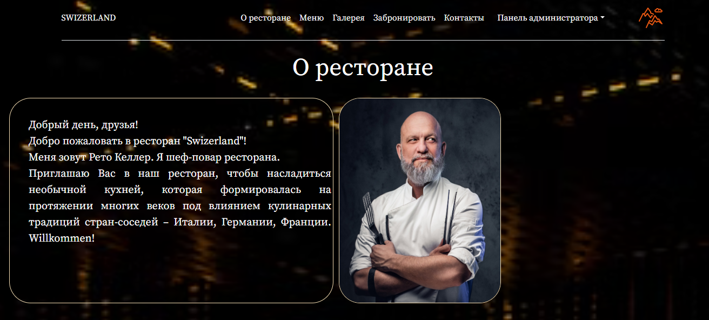
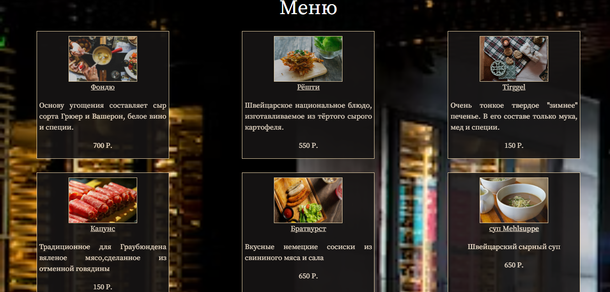
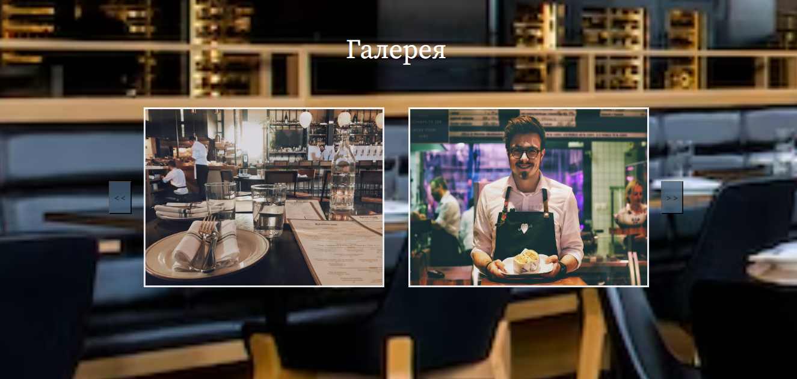
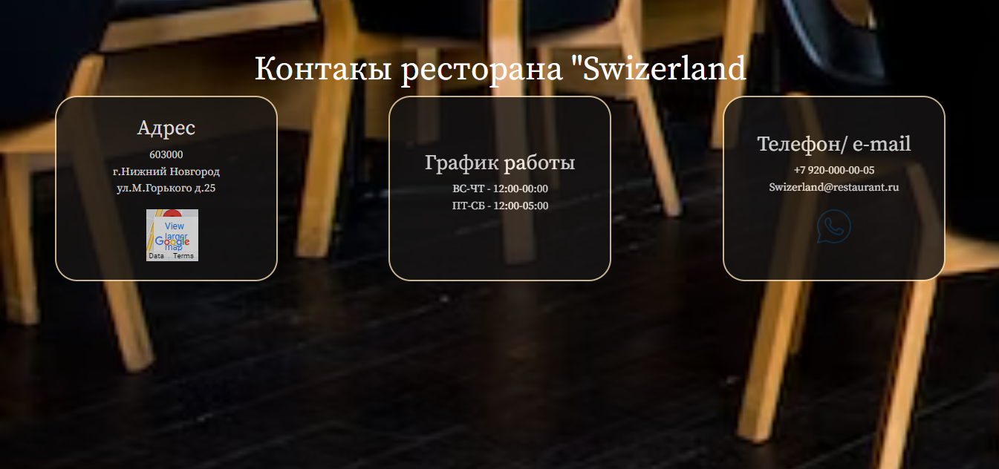
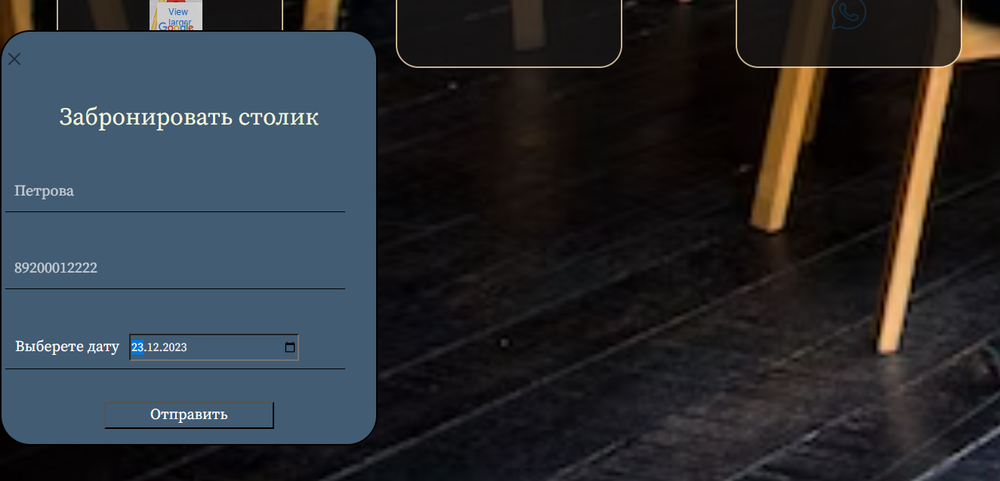
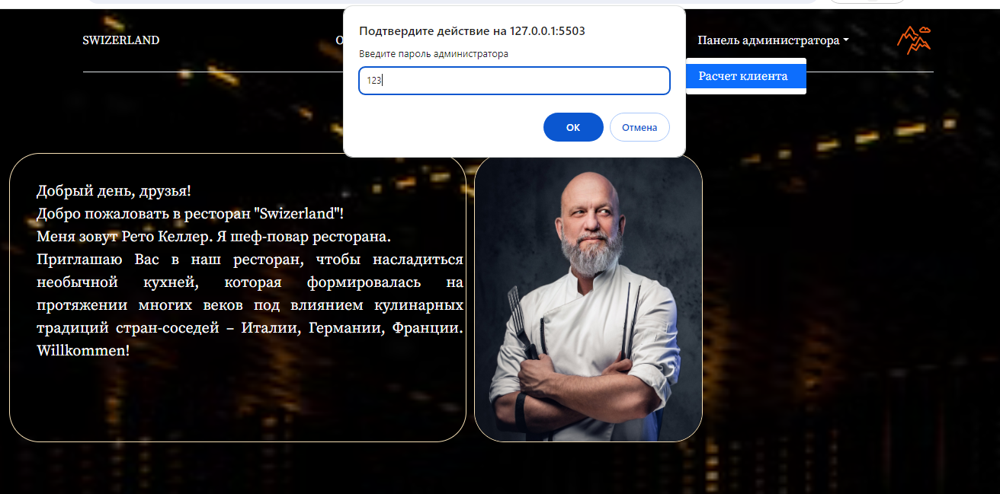
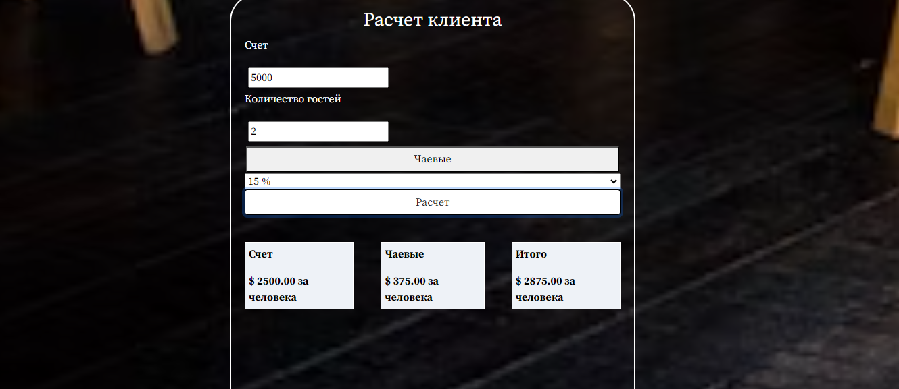

<h1>RESTAURANT SWIZERLAND</h1>

The main aim of this site is to introduce the restaurant's conception to the visitors and all people loving to eat, show advantages of the restaurant such as desing, vibes, menu, price, to inform of the latest offers and new items, sales and business hours, to give the opportunity to make a reservation in the place.  
The restaurant's manager can use the speciall panel for making a bill adding the tips or removing them at all and also he can split the bill. 
The site can help the manager to do the visitors analisys and get in touch with them creating the customer base

---

 

 

 

 

 

 

<h3>Contributing</h3>
Bug reports and/or pull requests are welcome.

<h3>Liscence</h3>
The project can be used for educational purposes 

-----

Made using HTML/CSS/JavaScript